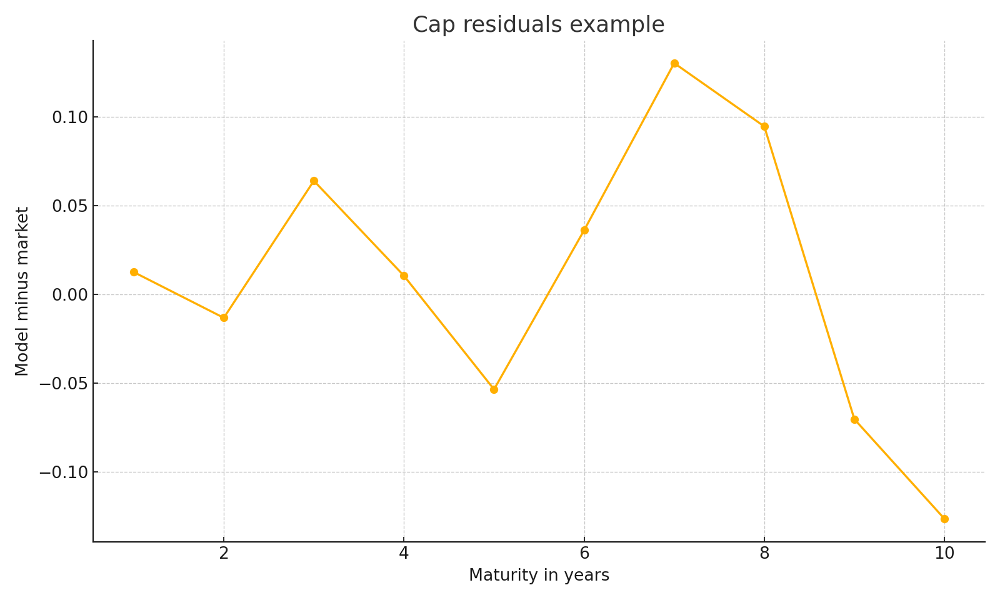
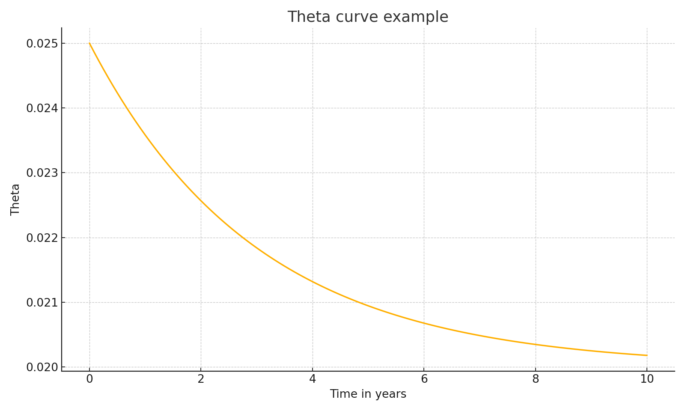

SOFR Caps Calibration and REMIC Tranche Pricing in Python

Project summary
I built a compact fixed income library that calibrates a one factor Hull White short rate model to SOFR cap prices for a single trade date and then prices a REMIC floater and a support tranche with option adjusted spread.

What I built
1  A reusable package under src that holds the curve tools, Hull White pricing, and a REMIC engine
2  A calibration script that reads simple CSV inputs and writes fitted parameters and diagnostics
3  A Monte Carlo tranche pricer with antithetic variates and an option adjusted spread solver
4  A walkthrough notebook that ties the work together and produces figures

Repository structure
src slash quantfi slash __init__.py
src slash quantfi slash curves.py
src slash quantfi slash hull_white.py
src slash quantfi slash remic.py
scripts slash calibrate_hw.py
scripts slash price_remic.py
scripts slash setup.sh
data slash README.md
results slash README.md
notebooks slash sofr_caps_and_mbs_walkthrough.ipynb
tests slash test_calibration.py
tests slash test_remic.py
requirements.txt
LICENSE
.gitignore

Quick start
1  Run scripts slash setup.sh to create a local virtual environment and install requirements
2  Place the five CSV inputs described in data slash README.md
3  Run scripts slash calibrate_hw.py to fit kappa and sigma and write results under results
4  Run scripts slash price_remic.py to produce tranche values and option adjusted spread
5  Open the notebook for an end to end narrative with figures

Inputs expected under data
1  P_caplet_accruals_YYYYMMDD.csv with a single column named accrual_dfs
2  P_caplet_payments_YYYYMMDD.csv with a single column named payment_dfs
3  cap_sofr_atm_strikes_YYYYMMDD.csv with a single column named BBG_swap_rates
4  cap_sofr_atm_bachelier_vols_YYYYMMDD.csv with a single column named bachelier_vols in basis points
5  sofr_cap_bloomberg_pv_YYYYMMDD.csv with a single column named BBG_sofr_caps in dollars for a ten million notional cap

Outputs written to results
1  hw_fit.json with kappa, sigma, and optional error metrics
2  theta_t.json with a monthly grid and the fitted theta path
3  remic_summary.json with price per one hundred, standard error per one hundred, and option adjusted spread for FA and SA
4  residuals and theta figures that the notebook saves for quick review

Figures
These images are created by the notebook or can be refreshed by rerunning the scripts

Design choices I made
1  Model one factor Hull White for transparency and speed with closed form caplets
2  Data interface simple CSV files to avoid vendor lock in
3  Monte Carlo antithetic variates for variance reduction and clear standard error reporting
4  REMIC cash flow split into FA and SA only to keep the example focused
5  No outside frameworks so a reviewer can run everything with the standard scientific stack

Testing
1  Minimal smoke tests cover shapes and simple invariants
2  Add more cases easily under tests when you want deeper checks

Acknowledgment
This work grew out of my time at UC Berkeley and was restructured here as an independent project
